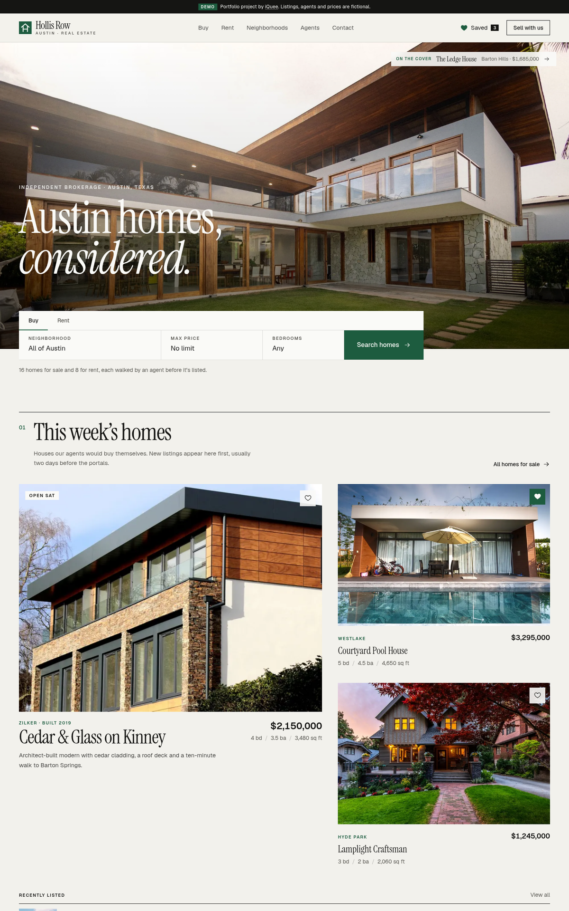
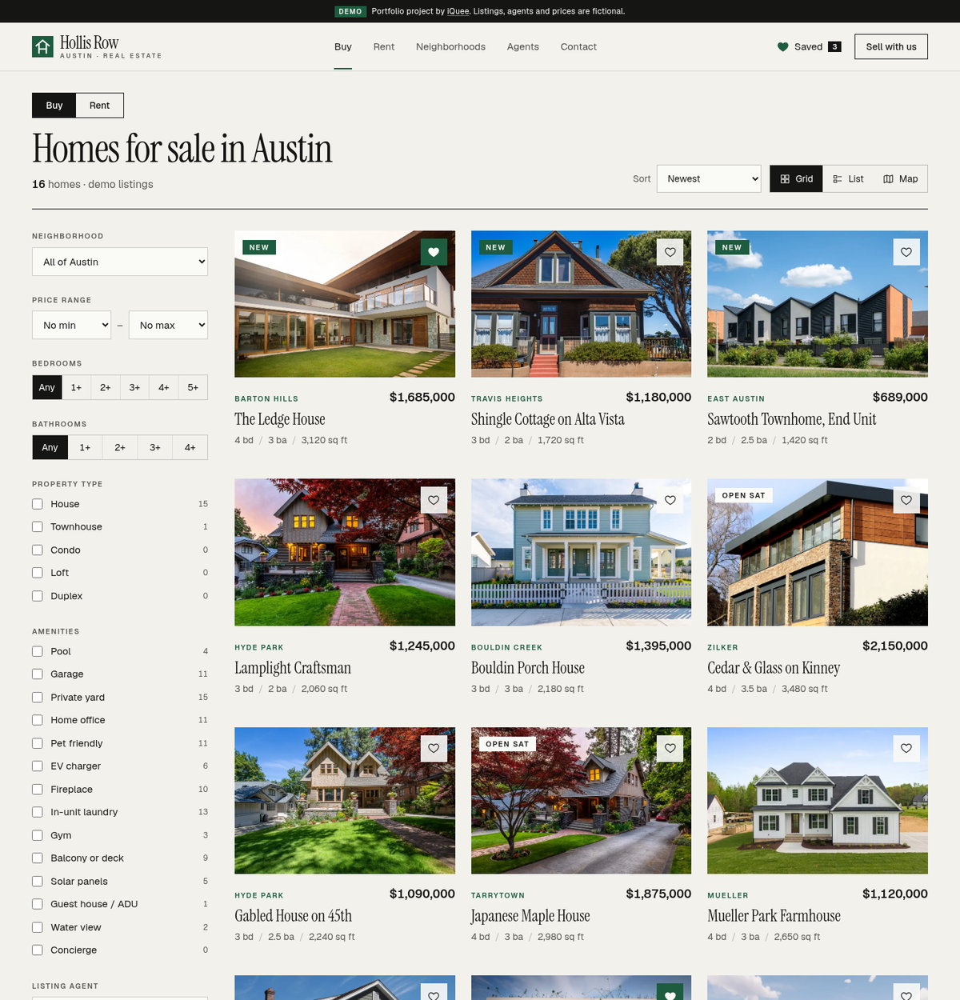
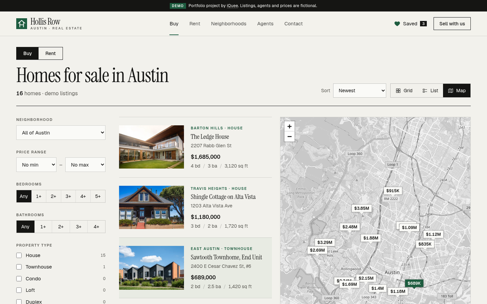
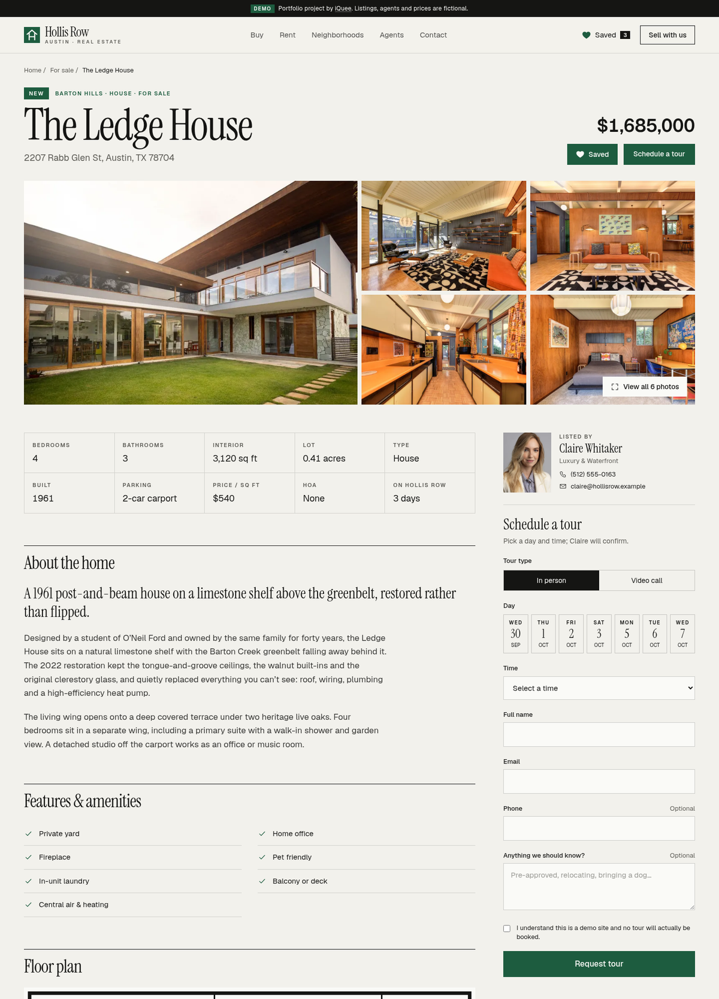
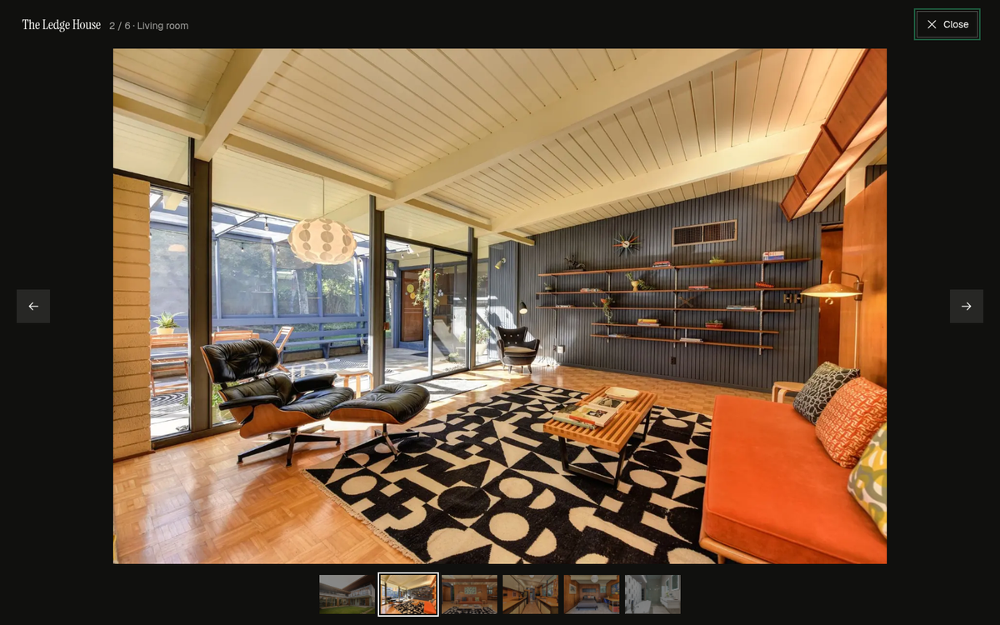
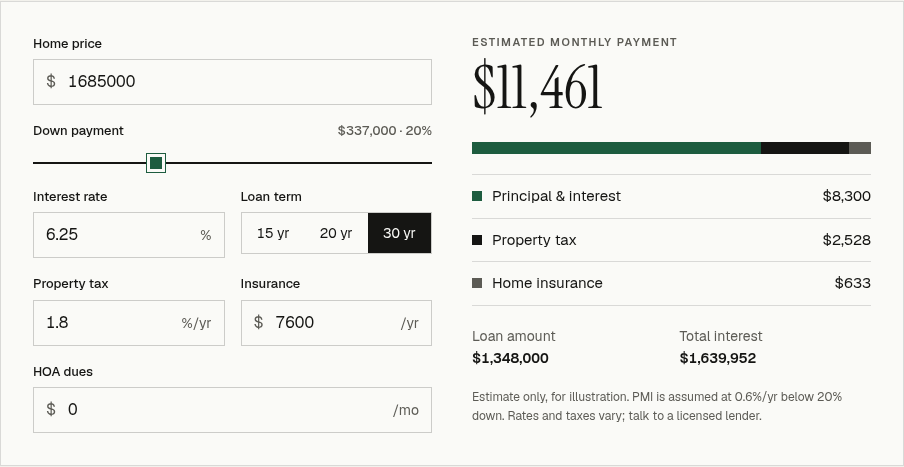
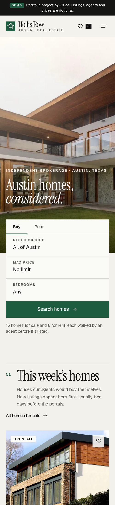
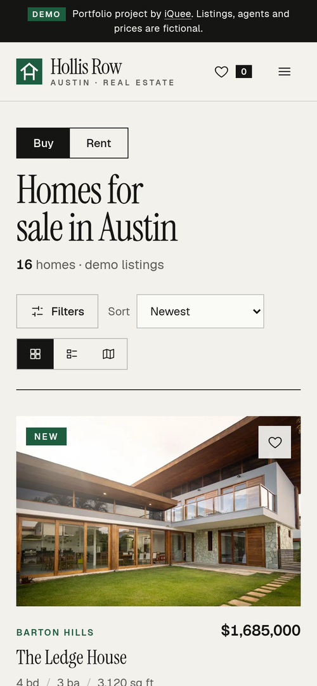

# Hollis Row — real-estate listing website (demo by iQuee)

A frontend-only property portal for **Hollis Row**, a fictional independent brokerage in Austin, Texas.
Editorial look (big photography, Instrument Serif headlines, one deep "live-oak" green accent, square corners and hairline rules),
seeded with 24 listings — 16 for sale, 8 for rent — six agents and six neighborhood guides.
**Demo only — every listing, agent, price and address is fictional. Nothing is for sale and no form sends data anywhere.**

- Live demo: https://estate.iquee.tech
- Repository: https://github.com/wannn28/Estate-Iquee

## Features

- **Home:** full-bleed hero with Buy/Rent search (neighborhood, max price, beds), editorial featured-homes layout,
  "recently listed" index table, neighborhood guides, agent strip, testimonial switcher, seller CTA.
- **Search** (`/search`): Buy/Rent toggle; filters for neighborhood, price range, beds, baths, property type, 14 amenities and
  listing agent (with live counts); removable filter chips; sort (newest, price ↑/↓, largest); **grid / list / map** views.
  All state is in the URL, so every search is shareable. Mobile gets a slide-in filter drawer.
- **Map view:** Leaflet + OpenStreetMap tiles (no API key), price-label markers that highlight when you hover a result,
  popups with photo and link, auto-fit to the current results.
- **Property detail** (`/listing/:slug`): photo mosaic + keyboard/touch **lightbox** (←/→, Esc, swipe, thumbnails, focus trap),
  key-facts grid, description, amenities, **schematic floor plan** (SVG generated from room count and area), location map with
  nearby list, **mortgage calculator** (price, down-payment slider, rate, 15/20/30-yr term, tax, insurance, HOA, PMI, stacked
  breakdown) — rentals show move-in costs instead — agent card, **schedule-a-tour form** with inline + summary validation and a
  confirmation state, and similar listings.
- **Saved homes** (`/saved`): heart any listing; saved list and a compare table persist in `localStorage`.
- **Agents** (`/agents`) and **Contact** (`/contact`, validated form with topic + preferred agent, office map).
- Accessibility: semantic landmarks, skip link, labelled controls, `aria-invalid`/`aria-describedby` on errors,
  visible focus rings, keyboard-operable radios/toggles, reduced-motion support. Responsive from 360 px up.

## Tech Stack

| Area | Technology (version in package.json → installed) |
| --- | --- |
| Frontend framework / language | React `^18.3.1` (18.3.1), React DOM `^18.3.1`, TypeScript `~5.6.2` (5.6.3, strict mode) |
| Styling | Tailwind CSS `^3.4.19`, PostCSS `^8.5.28`, Autoprefixer `^10.6.1`; self-hosted fonts via Fontsource: Instrument Serif `^5.3.0`, Geist Variable `^5.3.0` |
| Routing | React Router DOM `^6.30.6` (client-side routing, URL-synced search filters) |
| Maps | Leaflet `^1.9.4`, React Leaflet `^4.2.1`, OpenStreetMap raster tiles (no API key); `@types/leaflet` `^1.9.22` |
| Charts / animation | None — the payment breakdown bar, floor plans and icons are hand-written SVG/CSS; transitions are plain CSS |
| State / data storage | React state + Context. **No backend and no database**: listings, agents, neighborhoods and testimonials are seeded mock data in `src/data/*.ts`; saved homes and demo tour requests persist only in the browser's `localStorage` |
| Build tooling | Vite `^5.4.10` (5.4.21) with `@vitejs/plugin-react` `^4.3.3`; `base: '/'`; static output in `dist/` |
| Linting | ESLint `^9.13.0` (flat config), typescript-eslint `^8.11.0`, eslint-plugin-react-hooks `^5.0.0`, eslint-plugin-react-refresh `^0.4.14` |
| Testing / screenshots | Playwright (Python) scripts `shots.py` and `flow.py` (end-to-end smoke test) |
| Hosting / deploy (target) | Static `dist/` served by **Nginx on an Ubuntu VPS, behind Cloudflare, with Let's Encrypt SSL**, SPA fallback to `index.html` |

### Production-ready path

This demo intentionally has no server. A real brokerage deployment would add: a REST API (e.g. Node/NestJS or Go)
backed by **PostgreSQL** (with PostGIS for map/radius queries) and an MLS/IDX feed import; server-side search and pagination;
image storage on S3-compatible object storage behind a CDN; authenticated accounts so saved homes sync across devices;
tour/contact submissions going to a CRM plus transactional email; and a commercial or self-hosted tile provider in place of the
public OSM tile servers. None of that exists in this repository.

## Run it

```bash
npm install
npm run dev        # local dev
npm run build      # tsc -b && vite build -> dist/ (serve at the domain root with SPA fallback to index.html)
npm run lint
npx vite preview --port 4391 &
/workspace/.venv-pw/bin/python shots.py   # screenshots -> shot-*.png
/workspace/.venv-pw/bin/python flow.py    # end-to-end checks (filters, favorites, tour form, lightbox, calculator, contact)
```

Nginx SPA fallback: `location / { try_files $uri $uri/ /index.html; }`

## Screenshots

| Home | Search — grid |
| --- | --- |
|  |  |
| **Search — map** | **Property detail** |
|  |  |
| **Lightbox** | **Mortgage calculator** |
|  |  |
| **Mobile — home** | **Mobile — search** |
|  |  |

## Notes & caveats

- Photos are Pexels stock images (credits in [CREDITS.md](CREDITS.md)); one photo set is reused across a few listings' interiors.
- Map tiles are fetched live from `tile.openstreetmap.org`, which is fine for a low-traffic portfolio demo under the OSM tile
  usage policy but not for production traffic.
- Floor plans are schematic, generated from bedroom/bath count and area — not real measured plans.
- Street names are real Austin streets with invented house numbers; coordinates are approximate.
